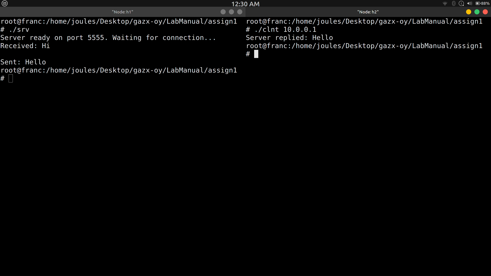

# Question 1
Write a program to run TCP client and server socket programs where client first
says “Hi” and in response server says “Hello”.


- compile the srv.c and run in host node h1 with IP 10.0.0.1
- server listens on port 5555 
- compile the clnt.c and run in host node h1 with IP 10.0.0.2
- NOTE - during running the executable pass the host IP 


## cpy & pst

```bash
gcc srv.c -o srv
./srv
```
Make sure to run clnt in h2 
```bash
gcc clnt.c -o clnt
./clnt 10.0.0.1
```
