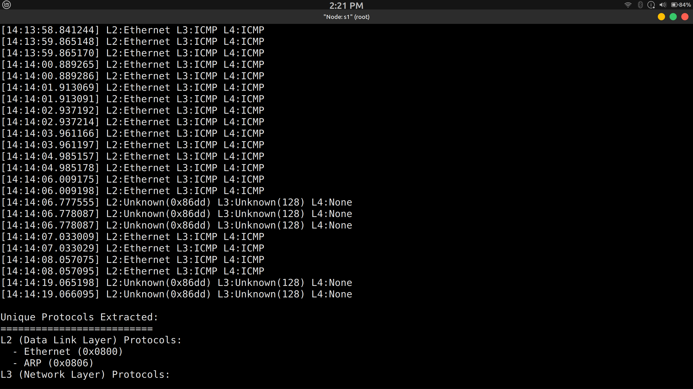

# Question 13
Create a binary tree topology with 7 switches in mininet. Capture packets at the root
switch. Write a C program to extract the headers and draw a time diagram to show
the protocols displayed in the captured file (save the .pcap/.pcapng file of
wireshark/tshark) during a PING operation. List the L2, L3, L4 protocols that can be
extracted from the .pcap/.pcapng file.

