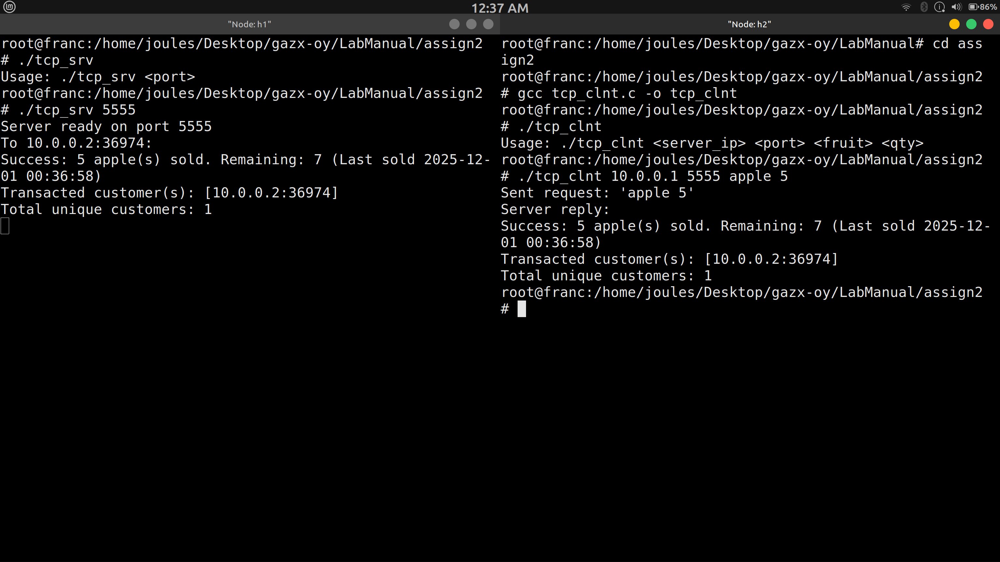

# Question 2
Write a program using TCP socket to implement the following:
i. Server maintains records of fruits in the format: fruit-name, quantity Last-sold,
(server timestamp),
ii. Multiple client purchase the fruits one at a time,
iii. The fruit quantity is updated each time any fruit is sold,
iv. Send regret message to a client if therequested quantityof the fruit is not
available.
v. Display the customer ids <IP, port> who has done transactions already. This
list should be updated in the server every time a transaction occurs.
vi. The total number of unique customers who did some transaction will be
displayed to the customer every time.



# Usage

- compile the srv.c and run in host node h1 with IP 10.0.0.1
- server listens on port 5555 
- compile the clnt.c and run in host node h1 with IP 10.0.0.2
- NOTE - during running the executable pass the host IP , port , fruit_name quantity 

- for getting the fruits and their quantity read the tcp_srv.c code
- try with mulitple clients in diff host of mininet

## cpy & pst

```bash
gcc tcp_srv.c -o tcp_srv
./tcp_srv
```
Make sure to run clnt in h2 
```bash
gcc tcp_clnt.c -o tcp_clnt
./clnt 10.0.0.1 5555 apple 5
```
## Main Concepts Used

- TCP sockets: socket(), bind(), listen(), accept(), connect(), read(), write()

- Data parsing and updating (fruit quantity, last sold timestamp)

- Simple unique customer tracking (<IP, port>)

- Regret message if not enough quantity.

- Client sees running list and total unique customer count every transaction.
