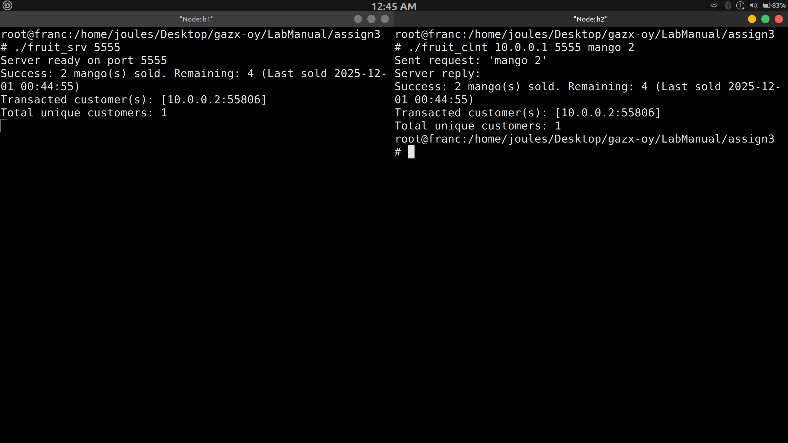

# Question 3
Redo assignment 2 using UDP socket.



# Usage

- compile the srv.c and run in host node h1 with IP 10.0.0.1
- server listens on port 5555 
- compile the clnt.c and run in host node h1 with IP 10.0.0.2
- NOTE - during running the executable pass the host IP , port , fruit_name quantity 

- for getting the fruits and their quantity read the tcp_srv.c code
- try with mulitple clients in diff host of mininet

## cpy & pst

```bash
gcc tcp_srv.c -o tcp_srv
./tcp_srv
```
Make sure to run clnt in h2 
```bash
gcc tcp_clnt.c -o tcp_clnt
./clnt 10.0.0.1 5555 mango 2
```

# Each client will be told:

    Transaction status,

    all customer <IP> <port> who ever bought,

    and total unique customers.
