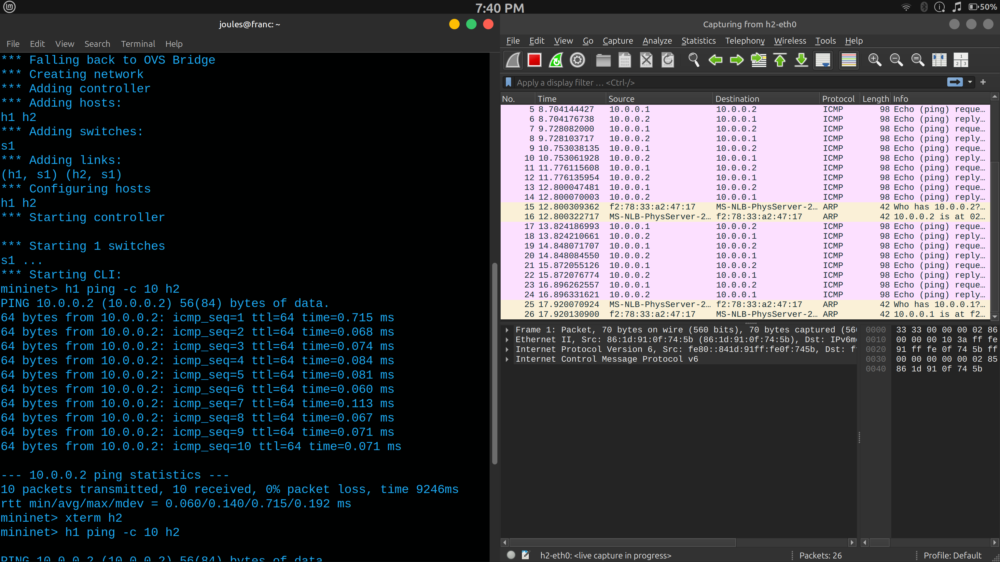

# Exercise

Install wireshark in a VM (Virtual Machine) environment. Draw a time diagram to
show the steps in the protocols recorded in the captured file (saved in the .pcap file
of wireshark) during a PING operation. List the L2, L3, L4 header fields that can be
extracted from the .pcap file.

