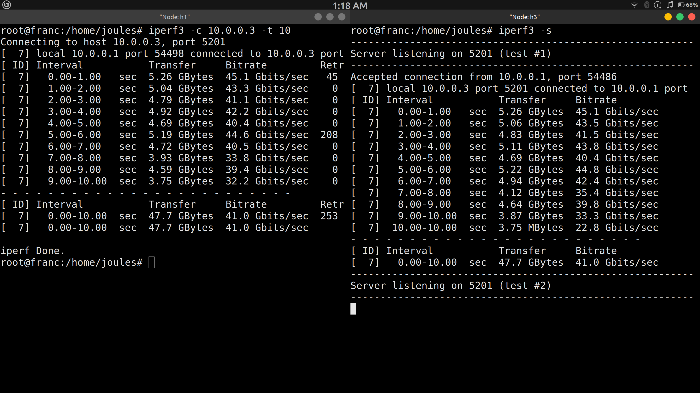

# Question 5
Learn and use maximum number of packet generation tools.



# Exercise

Learn and use maximum number of packet generation tools.

```bash
sudo mn --topo linear,3
```

# on h3 node
```bash
iperf3 -s
```
# on h1 node 
```bash
iperf3 -c 10.0.0.3 -t 10
```


### outcome 
These outcomes directly map to CCNA, SDN, and network engineering certifications!
