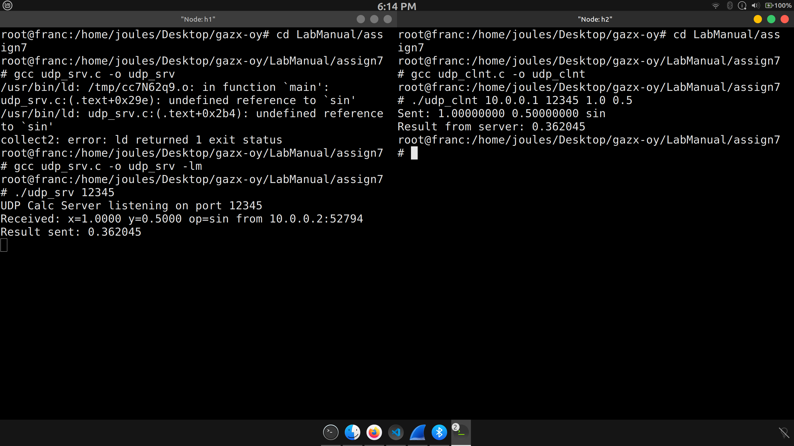

# Question 7
Write UDP client server socket program where client sends one/two number(s)
(integer or floating point) to server and a scientific calculator operation (like
sin,cos,*,/, inv etc.) and server responds with the result after evaluating the value of
operation as sent by the client. Server will maintain a scientific calculator. Detect in
the mininet hosts with wireshark if there is any packet loss? Show it to the TA.
start server on h1


# Build and run
- Compile the UDP calc server (math library required for sin):

```sh
gcc udp_srv.c -o udp_srv -lm
./udp_srv 12345
```

- Compile the client:

```sh
gcc clnt.c -o clnt
./clnt 10.0.0.1 12345 1.0 0.5
```

Notes:
- The server computes currently only sin(x) - sin(y).
