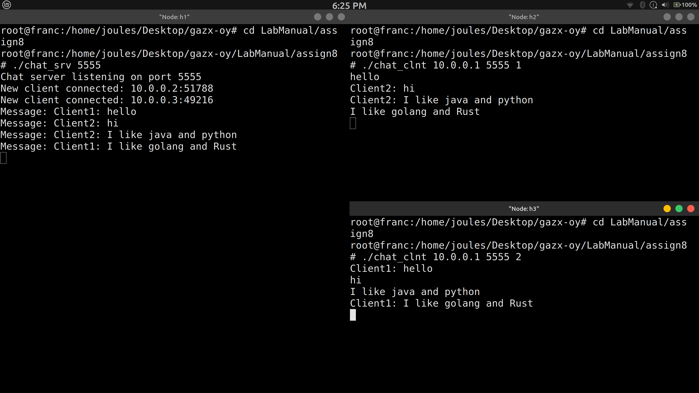

# Question 8
Write a program in C using thread library and TCP sockets to build a chat server
which enable clients communicating to each other through the chat server. Message
logs must be maintained in the server in a text file. Each client will see the
conversations in real time. Clients must handled by a server thread. (Keep it like a
group chatbox)




# Build and run
- Compile the server 

```sh
gcc chat_srv.c -o chat_srv 
./udp_srv 12345
```

- Compile the client:

```sh
gcc chat_clnt.c -o chat_clnt
./clnt 10.0.0.1 12345 1
```

Notes:
- All messages are broadcast to all connected clients and logged to chatlog.txt on the server.

- start server on h1
